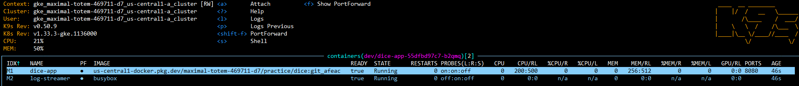

# Dice Spring Boot Application

## **1. Project Overview**

This project is a **Spring Boot Dice application** designed for DevOps demonstration purposes. It simulates dice rolls and exposes observability endpoints.

**Key features:**

* REST endpoints: `/dice`, `/health`, `/actuator/health`, `/actuator/prometheus`
* Logs written to `/var/log/dice/application.log`
* Containerized with multi-stage Docker builds
* Deployed to Kubernetes with sidecar log streaming
* Monitored via **Prometheus, Grafana dashboards, and K8s dashboards**
* External access through Ingress: `http://34.8.58.112/`

---

## **2. Endpoints**

| Endpoint               | Method | Description                    | Access                                                                           |
| ---------------------- | ------ | ------------------------------ | -------------------------------------------------------------------------------- |
| `/dice`                | GET    | Generates a random dice number | [http://34.8.58.112/dice](http://34.8.58.112/dice)                               |
| `/health`              | GET    | Readiness check                | [http://34.8.58.112/health](http://34.8.58.112/health)                           |
| `/actuator/health`     | GET    | Liveness check                 | [http://34.8.58.112/actuator/health](http://34.8.58.112/actuator/health)         |
| `/actuator/prometheus` | GET    | Prometheus metrics endpoint    | [http://34.8.58.112/actuator/prometheus](http://34.8.58.112/actuator/prometheus) |

---

## **3. Docker Setup**

The application is containerized using a **multi-stage Dockerfile**:

1. **Builder Stage** → Maven downloads dependencies and builds the JAR.
2. **Tester Stage** → Runs Maven tests.
3. **Runtime Stage** → Uses `eclipse-temurin:17-jre-jammy`, creates `/var/log/dice`, sets correct permissions, and runs the app.

**Sidecar container**:

* Tails `/var/log/dice/application.log` for real-time log streaming.

**Key Points**:

* Logs are stored at `/var/log/dice/application.log`
* `spring` user created for non-root execution

---

## **4. CI Pipeline**

The project includes a **CI Pipeline (GitHub Actions)** to automate builds and testing:

**Steps:**

1. Checkout repository
2. Set up **JDK 17** & **Maven**
3. Build Maven project
4. Login to **GCP Artifact Registry**
5. Build, test, and push Docker image with tag: `git_<last5commit>`

**Purpose**:

* Build a pipeline that will build, test, and push the image to **GCP Artifact Registry**

---

## **5. Kubernetes Deployment**

The application is deployed in the `dev` namespace with the following configuration:

**Deployment Configuration:**

* Replicas: 2
* CPU: 200m request / 500m limit
* Memory: 256Mi request / 512Mi limit
* **Probes**:

  * Readiness: `/health`
  * Liveness: `/actuator/health`
* **Volumes**: `emptyDir` mounted at `/var/log/dice` (shared between main and sidecar)
* **Security context**: runAsUser 1000, fsGroup 1000, non-root

**Service**:

* Exposes the application on port 80 within the cluster

**Sidecar container**:

* Name: `log-streamer`
* Uses busybox to tail `/var/log/dice/application.log`
* Readiness probe waits until log file exists

**Ingress**:

* Exposes `/dice` and all endpoints externally at `http://34.8.58.112/`

**Kubernetes Diagram**:

---

## **6. Prometheus Monitoring**

**Service**:

* Exposes `/actuator/prometheus` endpoint on port 8080

**ServiceMonitor**:

* Located in `monitoring` namespace
* Scrapes `dev` namespace every 30s

**Grafana Dashboards**:

* Displays metrics from Prometheus
* Includes:
  * K8s pod metrics
  * ServiceMonitor metrics

---

## **7. Screenshots**

**Pods & Deployment**:

* Pod creation and readiness status:
  
  
* Sidecar:
  
**Grafana Dashboards**:

* Metrics from K8s pods:
  
  
* Metrics from ServiceMonitor:
  
  
*  K8s Dashboard:
  

---

## **8. Notes & Key Points**

* Fully containerized and orchestrated with Kubernetes
* Real-time log streaming via sidecar container
* CI pipeline builds, tests, and pushes images to **GCP Artifact Registry**
* Observability implemented using Prometheus, Grafana, and K8s dashboards
* External access available via Ingress at `http://34.8.58.112/`
* Designed for **DevOps demonstration**, easy to scale, monitor, and maintain

